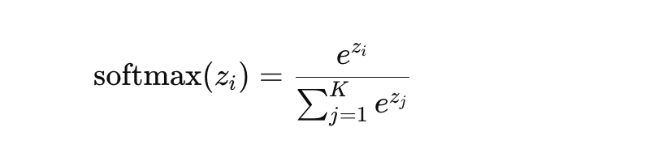

# HW to Chapter 12 “Softmax”  

## Non-programming Assignment  

### Q1. What is the reason for softmax?  

Answer:  

The softmax function is widely used in machine learning and deep learning, particularly in the context of classification tasks, due to several compelling reasons:  

#### Probability Distribution:

Softmax converts the raw scores (logits) from the model into probabilities by taking the exponent of each output and then normalizing these values by dividing by the sum of all the exponents. This ensures that the output values are in the range (0, 1) and sum up to 1, making them interpretable as probabilities.  

#### Multi-class Classification:

In scenarios where an input needs to be classified into one of several possible categories, softmax provides a means to identify the probability that the input belongs to each category. It is particularly useful in the final layer of a neural network model for multi-class classification tasks.  

#### Gradient Optimization Compatibility:

The softmax function is smooth and differentiable. This property is crucial because it allows the function to be incorporated into a neural network model where gradient-based optimization methods, such as stochastic gradient descent, are used. The gradients of the softmax function can be easily computed, enabling efficient training of the model through backpropagation.  

#### Exploiting the Relative Differences Between Logits:

By using the exponential function, softmax amplifies the differences between the logits. This means that even small differences in the logits can lead to significant differences in the probabilities, making it easier for the model to differentiate between more and less likely classes.  

#### Enhancing Numerical Stability:

Softmax incorporates a technique for numerical stability by subtracting the maximum logit from all logits before exponentiation. This adjustment prevents potential numerical overflow by ensuring that the largest exponent in the numerator and denominator is 0, making the softmax function more robust in practice.

#### Soft Decision Boundaries:

Unlike hard maximum functions that pick the maximum value, softmax provides a "soft" decision making by assigning probabilities to each class, which can be particularly useful in cases where the model needs to be cautious about its decisions.  

In summary, the softmax function is crucial for transforming the outputs of a model into a probabilistic framework, enabling the model to perform multi-class classification tasks effectively. Its properties align well with the requirements of gradient-based optimization, making it an indispensable component of neural network architectures designed for classification.

### Q2. What is softmax and how does it works?  

Answer:  

The softmax function is a mathematical function extensively used in machine learning and deep learning, particularly in the context of classification tasks. It serves to convert a vector of raw scores (often referred to as logits) from a neural network into a probability distribution over predicted output classes. The function is especially crucial in multi-class classification problems, where each input can belong to one among several classes.

#### How Softmax Works
Given a vector of K real numbers z=[z1, z2, ..., zK] representing the raw scores for K classes from a model, the softmax function converts these scores into probabilities by applying the following steps:

Exponentiation: It computes the exponential e^z of i for each score z of i in the vector. This step ensures all the output values are non-negative. Since the exponential function grows very rapidly, this step also helps in amplifying differences between the input scores, making the highest score significantly more dominant in the output distribution if there is a clear leading score.

Normalization: It then divides each exponentiated score by the sum of all exponentiated scores in the vector:

This normalization ensures that the sum of the output probabilities is 1, making the output a valid probability distribution. Each probability corresponds to the model's confidence in each class, relative to the other classes.

#### Properties of Softmax  

Output Range: Each output of the softmax function is in the range (0, 1), inclusive. This makes the output interpretable as probabilities.  

Sum to One: The sum of all the output probabilities is exactly 1, which is a fundamental property of probability distributions.  

Differentiable: The softmax function is continuous and differentiable everywhere, a property that is crucial for optimizing models using gradient-based methods.  

#### Why Softmax?   

Softmax is used in the final layer of a neural network model for multi-class classification because it provides a probabilistic interpretation of the model's outputs, enabling a straightforward way to identify the predicted class (the one with the highest probability). Additionally, during training, the difference between the predicted probability distribution and the true distribution (usually represented as a one-hot vector) can be quantified using a loss function like cross-entropy, facilitating the model's learning process.

In essence, softmax serves as the bridge between the raw logits produced by a model and the probabilistic interpretation needed for classification tasks, making it a key component in the design and functionality of neural networks for classification.
